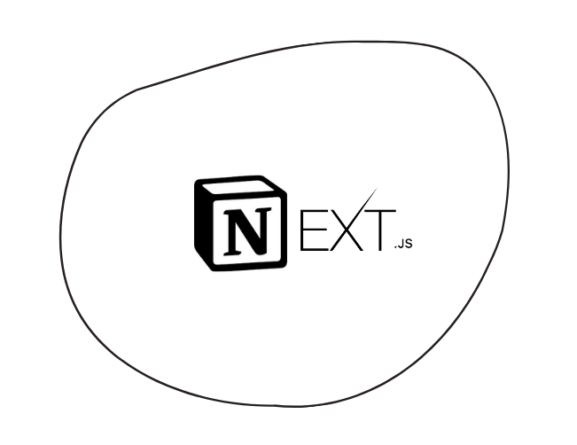

<p align="center">
  
</p>

Este repositório é o resultado deste tutorial:

[https://jeanbauer.dev/blog/criando-seu-blog-com-notion-e-nextjs](https://jeanbauer.dev/blog/criando-seu-blog-com-notion-e-nextjs)

✨ Com alguma estilização extra e mais componentes ✨

## Começando

Primeiro, instale as dependências:

```bash
npm install
# ou
yarn
```

Depois, inicie a aplicação:

```bash
npm run dev
# ou
yarn dev
```

Abra [http://localhost:3000](http://localhost:3000) com seu browser para ver o resultado.


## Aprenda mais

Para saber mais sobre Next.js, dê uma olhada nos seguintes recursos:

- [Next.js Documentation](https://nextjs.org/docs) - aprenda sobre funcionalidades e a API do Next.js.
- [Learn Next.js](https://nextjs.org/learn) - Tutorial interativo do Next.js.


## Deploy na Vercel

A forma mais fácil de fazer deploy é na [Vercel Platform](https://vercel.com/import?utm_medium=default-template&filter=next.js&utm_source=create-next-app&utm_campaign=create-next-app-readme).

## Extra

Este é um projeto [Next.js](https://nextjs.org/) criado a partir do [`create-next-app`](https://github.com/vercel/next.js/tree/canary/packages/create-next-app).
